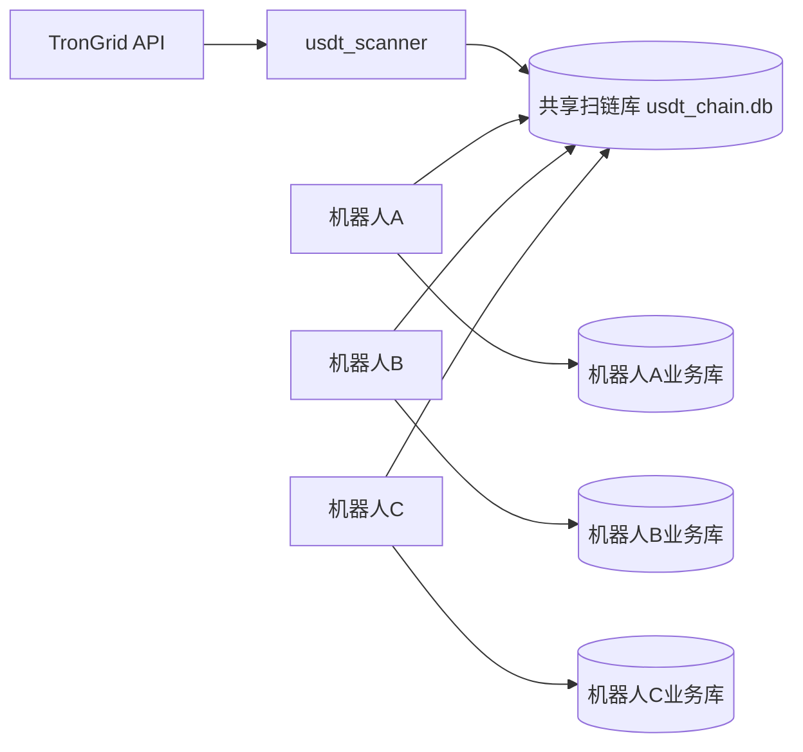

# 多机器人 USDT 扫链部署文档

本文档说明如何从零部署多个 fakabot 机器人，并让它们共用一个 USDT(TRC20) 扫链服务，避免每个机器人都请求 TronGrid 导致 API key 被限流。

## 0. 六个机器人从零部署总览

本节按“一台新的 Ubuntu 服务器，Docker 和 Docker Compose 已经安装好，要部署 6 个发卡机器人”的场景编写。下面命令假设：

- 服务器目录使用 `/opt/fakabot-cluster`。
- 6 个机器人分别命名为 `bot01` 到 `bot06`。
- 共享扫链服务命名为 `scanner`。
- 共享扫链数据库放在 `/opt/fakabot-cluster/shared/usdt_chain.db`。
- 每个机器人都有自己的 `config.json`、`data/sp_shop.db`、Redis 容器和宿主机端口。
- 只有 `scanner` 请求 TronGrid，6 个业务机器人都不请求 TronGrid。

最终目录结构：

```text
/opt/fakabot-cluster/
  source/
  shared/
    usdt_chain.db
  scanner/
    fakabot/
  bot01/
    fakabot/
    data/
  bot02/
    fakabot/
    data/
  bot03/
    fakabot/
    data/
  bot04/
    fakabot/
    data/
  bot05/
    fakabot/
    data/
  bot06/
    fakabot/
    data/
```

端口规划：

| 机器人 | 容器名 | Redis 容器名 | HTTP 端口 | 备用端口 |
| --- | --- | --- | --- | --- |
| `bot01` | `fakabot-bot01` | `fakabot-bot01-redis` | `58201` | `58301` |
| `bot02` | `fakabot-bot02` | `fakabot-bot02-redis` | `58202` | `58302` |
| `bot03` | `fakabot-bot03` | `fakabot-bot03-redis` | `58203` | `58303` |
| `bot04` | `fakabot-bot04` | `fakabot-bot04-redis` | `58204` | `58304` |
| `bot05` | `fakabot-bot05` | `fakabot-bot05-redis` | `58205` | `58305` |
| `bot06` | `fakabot-bot06` | `fakabot-bot06-redis` | `58206` | `58306` |

### 0.1 登录服务器并准备变量

先 SSH 登录你的 Ubuntu 服务器：

```bash
ssh root@你的服务器IP
```

创建部署目录：

```bash
mkdir -p /opt/fakabot-cluster
cd /opt/fakabot-cluster
```

创建一份部署变量文件，后续脚本会读取它。把里面的占位符改成你自己的值：

```bash
cat > /opt/fakabot-cluster/deploy.env <<'EOF'
REPO_URL="你的fakabot仓库地址"
ADMIN_ID="你的Telegram管理员数字ID"

TRONGRID_KEY_1="你的TronGridKey1"
TRONGRID_KEY_2="你的TronGridKey2"
TRONGRID_KEY_3="你的TronGridKey3"

BOT01_TOKEN="bot01的TelegramToken"
BOT02_TOKEN="bot02的TelegramToken"
BOT03_TOKEN="bot03的TelegramToken"
BOT04_TOKEN="bot04的TelegramToken"
BOT05_TOKEN="bot05的TelegramToken"
BOT06_TOKEN="bot06的TelegramToken"

BOT01_DOMAIN="https://pay.unishopasa.cn/bot11"
BOT02_DOMAIN="https://pay.unishopasa.cn/bot12"
BOT03_DOMAIN="https://pay.unishopasa.cn/bot13"
BOT04_DOMAIN="https://pay.unishopasa.cn/bot14"
BOT05_DOMAIN="https://pay.unishopasa.cn/bot15"
BOT06_DOMAIN="https://pay.unishopasa.cn/bot16"
EOF
```

检查变量文件：

```bash
sed -n '1,80p' /opt/fakabot-cluster/deploy.env
```

加载变量：

```bash
set -a
. /opt/fakabot-cluster/deploy.env
set +a
```

确认没有漏填：

```bash
printf '%s\n' "$REPO_URL" "$ADMIN_ID" "$BOT01_TOKEN" "$BOT06_DOMAIN" "$TRONGRID_KEY_1"
```

### 0.2 拉取项目源码

如果服务器可以直接访问 Git 仓库，执行：

```bash
cd /opt/fakabot-cluster
git clone "$REPO_URL" source
```

如果仓库已经拉过，更新即可：

```bash
cd /opt/fakabot-cluster/source
git pull
```

如果你不用 Git，可以在本地打包上传：

```bash
cd /opt/fakabot-cluster
mkdir -p source
```

然后从本地电脑上传项目压缩包到服务器后解压到 `/opt/fakabot-cluster/source`。

### 0.3 创建 6 个机器人目录和共享目录

```bash
cd /opt/fakabot-cluster
mkdir -p shared scanner
for bot in bot01 bot02 bot03 bot04 bot05 bot06; do
  mkdir -p "$bot/data"
done
chmod 755 shared
```

复制项目到 `scanner` 和 6 个机器人目录：

```bash
cd /opt/fakabot-cluster
rm -rf scanner/fakabot
cp -a source scanner/fakabot

for bot in bot01 bot02 bot03 bot04 bot05 bot06; do
  rm -rf "$bot/fakabot"
  cp -a source "$bot/fakabot"
done
```

确认目录已经生成：

```bash
find /opt/fakabot-cluster -maxdepth 2 -type d | sort
```

### 0.4 生成共享扫链服务配置

共享扫链服务只负责请求 TronGrid 和写入共享库，不处理订单。

```bash
cat > /opt/fakabot-cluster/scanner/fakabot/config.json <<EOF
{
  "BOT_TOKEN": "SCANNER_ONLY_DO_NOT_RUN_BOT",
  "ADMIN_ID": ${ADMIN_ID},
  "DOMAIN": "https://scanner.local",
  "ORDER_TIMEOUT_SECONDS": 3600,
  "PAYMENTS": {
    "usdt_trc20_direct": {
      "name": "USDT(TRC20直付)",
      "enabled": false,
      "priority": 20,
      "tron_api_key": "${TRONGRID_KEY_1}",
      "timeout_seconds": 3600,
      "scan_interval_seconds": 10,
      "confirmations": 2,
      "max_blocks_per_scan": 5,
      "start_block": ""
    }
  },
  "USDT_SCAN": {
    "mode": "shared_scanner",
    "shared_store": "/shared/usdt_chain.db",
    "scan_interval_seconds": 10,
    "confirmations": 2,
    "max_blocks_per_scan": 5,
    "tron_api_keys": [
      "${TRONGRID_KEY_1}",
      "${TRONGRID_KEY_2}",
      "${TRONGRID_KEY_3}"
    ]
  },
  "START": {
    "cover_url": "",
    "title": "Scanner",
    "intro": "Shared USDT scanner",
    "title_en": "Scanner",
    "intro_en": "Shared USDT scanner"
  },
  "SHOW_QR": true,
  "PRODUCTS": []
}
EOF
```

校验 JSON：

```bash
python3 -m json.tool /opt/fakabot-cluster/scanner/fakabot/config.json >/dev/null
```

### 0.5 生成 6 个业务机器人配置

下面命令会批量生成 `bot01` 到 `bot06` 的 `config.json`。它们全部使用 `match_only`，不会请求 TronGrid。

```bash
cat > /opt/fakabot-cluster/create_bot_config.sh <<'EOF'
#!/usr/bin/env bash
set -euo pipefail

bot="$1"
token="$2"
domain="$3"
admin_id="$4"
config_path="/opt/fakabot-cluster/${bot}/fakabot/config.json"

cat > "$config_path" <<JSON
{
  "BOT_TOKEN": "${token}",
  "ADMIN_ID": ${admin_id},
  "DOMAIN": "${domain}",
  "ORDER_TIMEOUT_SECONDS": 3600,
  "PAYMENTS": {
    "kavip_alipay": {
      "name": "支付宝",
      "enabled": true,
      "priority": 10,
      "merchant_id": "YOUR_KAVIP_MERCHANT_ID",
      "gateway": "https://kavip.biz/submit.php",
      "api_gateway": "https://kavip.biz/mapi.php",
      "key": "YOUR_KAVIP_API_KEY",
      "type": "alipay",
      "route": "/pay/kavip"
    },
    "usdt_trc20_direct": {
      "name": "USDT(TRC20直付)",
      "enabled": true,
      "priority": 20,
      "timeout_seconds": 3600,
      "cny_per_usdt": "7.20",
      "min_usdt_amount": "1.00"
    }
  },
  "USDT_SCAN": {
    "mode": "match_only",
    "shared_store": "/shared/usdt_chain.db",
    "scan_interval_seconds": 10
  },
  "START": {
    "cover_url": "https://img.example/start-cover.jpg",
    "title": "欢迎选购",
    "intro": "这里是商店简介，可在后台或配置中调整。",
    "title_en": "Welcome",
    "intro_en": "Welcome."
  },
  "SHOW_QR": true,
  "PRODUCTS": [
    {
      "name": "VIP课程",
      "cover_url": "https://img.example/cover.jpg",
      "description": "商品简介",
      "image_url": "https://img.example/detail.jpg",
      "full_description": "商品详情",
      "price": 99.9,
      "tg_group_id": "-1001234567890",
      "deliver_type": "join_group"
    }
  ]
}
JSON
python3 -m json.tool "$config_path" >/dev/null
EOF
chmod +x /opt/fakabot-cluster/create_bot_config.sh
```

执行批量生成：

```bash
set -a
. /opt/fakabot-cluster/deploy.env
set +a

/opt/fakabot-cluster/create_bot_config.sh bot01 "$BOT01_TOKEN" "$BOT01_DOMAIN" "$ADMIN_ID"
/opt/fakabot-cluster/create_bot_config.sh bot02 "$BOT02_TOKEN" "$BOT02_DOMAIN" "$ADMIN_ID"
/opt/fakabot-cluster/create_bot_config.sh bot03 "$BOT03_TOKEN" "$BOT03_DOMAIN" "$ADMIN_ID"
/opt/fakabot-cluster/create_bot_config.sh bot04 "$BOT04_TOKEN" "$BOT04_DOMAIN" "$ADMIN_ID"
/opt/fakabot-cluster/create_bot_config.sh bot05 "$BOT05_TOKEN" "$BOT05_DOMAIN" "$ADMIN_ID"
/opt/fakabot-cluster/create_bot_config.sh bot06 "$BOT06_TOKEN" "$BOT06_DOMAIN" "$ADMIN_ID"
```

检查 6 个配置是否都是合法 JSON：

```bash
for bot in bot01 bot02 bot03 bot04 bot05 bot06; do
  python3 -m json.tool "/opt/fakabot-cluster/${bot}/fakabot/config.json" >/dev/null
  echo "${bot} config ok"
done
```

### 0.6 批量修改 6 个机器人的 Docker Compose

项目默认 compose 里的容器名和端口是固定的。部署 6 个机器人时必须改成不同的容器名和宿主机端口，否则会冲突。

创建批量修改脚本：

```bash
cat > /opt/fakabot-cluster/patch_bot_compose.sh <<'EOF'
#!/usr/bin/env bash
set -euo pipefail

bot="$1"
index="$2"
app_port="$3"
extra_port="$4"
compose="/opt/fakabot-cluster/${bot}/fakabot/docker-compose.yml"

sed -i "s/container_name: fakabot-redis/container_name: fakabot-${bot}-redis/g" "$compose"
sed -i "s/container_name: fakabot-usdt-scanner/container_name: fakabot-${bot}-usdt-scanner/g" "$compose"
sed -i "s/container_name: fakabot$/container_name: fakabot-${bot}/g" "$compose"
sed -i "s/fakabot_network/fakabot_${bot}_network/g" "$compose"
sed -i "s/redis_data:/redis_data_${bot}:/g" "$compose"
sed -i "s/usdt_chain_data:/usdt_chain_data_${bot}:/g" "$compose"
sed -i "s#- ./data:/app/data#- /opt/fakabot-cluster/${bot}/data:/app/data#g" "$compose"
sed -i "s#- usdt_chain_data_${bot}:/shared#- /opt/fakabot-cluster/shared:/shared#g" "$compose"
sed -i "s#127.0.0.1:58001:58001#127.0.0.1:${app_port}:58001#g" "$compose"
sed -i "s#127.0.0.1:58002:58002#127.0.0.1:${extra_port}:58002#g" "$compose"
EOF
chmod +x /opt/fakabot-cluster/patch_bot_compose.sh
```

执行修改：

```bash
/opt/fakabot-cluster/patch_bot_compose.sh bot01 1 58201 58301
/opt/fakabot-cluster/patch_bot_compose.sh bot02 2 58202 58302
/opt/fakabot-cluster/patch_bot_compose.sh bot03 3 58203 58303
/opt/fakabot-cluster/patch_bot_compose.sh bot04 4 58204 58304
/opt/fakabot-cluster/patch_bot_compose.sh bot05 5 58205 58305
/opt/fakabot-cluster/patch_bot_compose.sh bot06 6 58206 58306
```

检查端口和容器名：

```bash
for bot in bot01 bot02 bot03 bot04 bot05 bot06; do
  echo "===== ${bot} ====="
  grep -E 'container_name:|127.0.0.1:|/shared|/app/data' "/opt/fakabot-cluster/${bot}/fakabot/docker-compose.yml"
done
```

### 0.7 修改 scanner 的 Docker Compose

共享扫链服务只需要启动 `usdt_scanner`，也要把共享目录挂载成宿主机目录。

```bash
cd /opt/fakabot-cluster/scanner/fakabot
sed -i 's/container_name: fakabot-redis/container_name: fakabot-scanner-redis/g' docker-compose.yml
sed -i 's/container_name: fakabot-usdt-scanner/container_name: fakabot-usdt-scanner/g' docker-compose.yml
sed -i 's/container_name: fakabot$/container_name: fakabot-scanner-bot-disabled/g' docker-compose.yml
sed -i 's/fakabot_network/fakabot_scanner_network/g' docker-compose.yml
sed -i 's/redis_data:/redis_data_scanner:/g' docker-compose.yml
sed -i 's/usdt_chain_data:/usdt_chain_data_scanner:/g' docker-compose.yml
sed -i 's#- usdt_chain_data_scanner:/shared#- /opt/fakabot-cluster/shared:/shared#g' docker-compose.yml
```

检查 scanner compose：

```bash
grep -E 'container_name:|/shared|command:' /opt/fakabot-cluster/scanner/fakabot/docker-compose.yml
```

### 0.8 构建镜像并检查 Compose 配置

先检查共享扫链服务：

```bash
cd /opt/fakabot-cluster/scanner/fakabot
docker compose --profile multi-bot config >/tmp/fakabot-scanner-compose.yml
echo "scanner compose ok"
```

检查 6 个机器人：

```bash
for bot in bot01 bot02 bot03 bot04 bot05 bot06; do
  cd "/opt/fakabot-cluster/${bot}/fakabot"
  docker compose config >/tmp/fakabot-${bot}-compose.yml
  echo "${bot} compose ok"
done
```

构建共享扫链服务镜像：

```bash
cd /opt/fakabot-cluster/scanner/fakabot
docker compose --profile multi-bot build usdt_scanner
```

构建 6 个机器人镜像：

```bash
for bot in bot01 bot02 bot03 bot04 bot05 bot06; do
  cd "/opt/fakabot-cluster/${bot}/fakabot"
  docker compose build sp_shop_bot
done
```

### 0.9 启动共享扫链服务

```bash
cd /opt/fakabot-cluster/scanner/fakabot
docker compose --profile multi-bot up -d usdt_scanner
```

查看日志：

```bash
docker logs -f fakabot-usdt-scanner
```

看到类似日志说明启动成功：

```text
✅ USDT共享扫链服务启动: store=/shared/usdt_chain.db, interval=10s
```

按 `Ctrl+C` 退出日志查看，不会停止容器。

### 0.10 启动 6 个业务机器人

逐个启动：

```bash
cd /opt/fakabot-cluster/bot01/fakabot && docker compose up -d redis sp_shop_bot
cd /opt/fakabot-cluster/bot02/fakabot && docker compose up -d redis sp_shop_bot
cd /opt/fakabot-cluster/bot03/fakabot && docker compose up -d redis sp_shop_bot
cd /opt/fakabot-cluster/bot04/fakabot && docker compose up -d redis sp_shop_bot
cd /opt/fakabot-cluster/bot05/fakabot && docker compose up -d redis sp_shop_bot
cd /opt/fakabot-cluster/bot06/fakabot && docker compose up -d redis sp_shop_bot
```

或批量启动：

```bash
for bot in bot01 bot02 bot03 bot04 bot05 bot06; do
  cd "/opt/fakabot-cluster/${bot}/fakabot"
  docker compose up -d redis sp_shop_bot
done
```

查看容器：

```bash
docker ps --format 'table {{.Names}}\t{{.Status}}\t{{.Ports}}'
```

检查 6 个机器人健康状态：

```bash
curl -s http://127.0.0.1:58201/health && echo " bot01 ok"
curl -s http://127.0.0.1:58202/health && echo " bot02 ok"
curl -s http://127.0.0.1:58203/health && echo " bot03 ok"
curl -s http://127.0.0.1:58204/health && echo " bot04 ok"
curl -s http://127.0.0.1:58205/health && echo " bot05 ok"
curl -s http://127.0.0.1:58206/health && echo " bot06 ok"
```

### 0.11 配置 Nginx 反向代理

本部署使用同一个主域名 `https://pay.unishopasa.cn`，通过路径区分 6 个机器人：

| 机器人 | 外部访问地址 | 内部端口 |
| --- | --- | --- |
| `bot01` | `https://pay.unishopasa.cn/bot11` | `58201` |
| `bot02` | `https://pay.unishopasa.cn/bot12` | `58202` |
| `bot03` | `https://pay.unishopasa.cn/bot13` | `58203` |
| `bot04` | `https://pay.unishopasa.cn/bot14` | `58204` |
| `bot05` | `https://pay.unishopasa.cn/bot15` | `58205` |
| `bot06` | `https://pay.unishopasa.cn/bot16` | `58206` |

你已经安装好 Nginx，并且主域名 SSL 证书也已经装好，所以不需要重新安装 Nginx，也不需要重新申请证书。只需要在 `pay.unishopasa.cn` 现有的 HTTPS `server` 块里增加 6 组 `location`。

先找到当前主域名配置文件：

```bash
grep -R "server_name pay.unishopasa.cn" -n /etc/nginx/sites-enabled /etc/nginx/sites-available /etc/nginx/conf.d
```

假设查到的文件是 `/etc/nginx/sites-available/pay.unishopasa.cn.conf`，先备份：

```bash
cp /etc/nginx/sites-available/pay.unishopasa.cn.conf \
  /etc/nginx/sites-available/pay.unishopasa.cn.conf.bak.$(date +%F-%H%M%S)
```

打开配置文件：

```bash
nano /etc/nginx/sites-available/pay.unishopasa.cn.conf
```

在 `server_name pay.unishopasa.cn;` 所在的 HTTPS `server` 块里加入下面配置。注意要放在这个 `server { ... }` 内部，不要放到文件最外层：

```nginx
location = /bot11 {
    return 301 /bot11/;
}

location /bot11/ {
    proxy_pass http://127.0.0.1:58201/;
    proxy_set_header Host $host;
    proxy_set_header X-Real-IP $remote_addr;
    proxy_set_header X-Forwarded-For $proxy_add_x_forwarded_for;
    proxy_set_header X-Forwarded-Proto $scheme;
    proxy_set_header X-Forwarded-Prefix /bot11;
}

location = /bot12 {
    return 301 /bot12/;
}

location /bot12/ {
    proxy_pass http://127.0.0.1:58202/;
    proxy_set_header Host $host;
    proxy_set_header X-Real-IP $remote_addr;
    proxy_set_header X-Forwarded-For $proxy_add_x_forwarded_for;
    proxy_set_header X-Forwarded-Proto $scheme;
    proxy_set_header X-Forwarded-Prefix /bot12;
}

location = /bot13 {
    return 301 /bot13/;
}

location /bot13/ {
    proxy_pass http://127.0.0.1:58203/;
    proxy_set_header Host $host;
    proxy_set_header X-Real-IP $remote_addr;
    proxy_set_header X-Forwarded-For $proxy_add_x_forwarded_for;
    proxy_set_header X-Forwarded-Proto $scheme;
    proxy_set_header X-Forwarded-Prefix /bot13;
}

location = /bot14 {
    return 301 /bot14/;
}

location /bot14/ {
    proxy_pass http://127.0.0.1:58204/;
    proxy_set_header Host $host;
    proxy_set_header X-Real-IP $remote_addr;
    proxy_set_header X-Forwarded-For $proxy_add_x_forwarded_for;
    proxy_set_header X-Forwarded-Proto $scheme;
    proxy_set_header X-Forwarded-Prefix /bot14;
}

location = /bot15 {
    return 301 /bot15/;
}

location /bot15/ {
    proxy_pass http://127.0.0.1:58205/;
    proxy_set_header Host $host;
    proxy_set_header X-Real-IP $remote_addr;
    proxy_set_header X-Forwarded-For $proxy_add_x_forwarded_for;
    proxy_set_header X-Forwarded-Proto $scheme;
    proxy_set_header X-Forwarded-Prefix /bot15;
}

location = /bot16 {
    return 301 /bot16/;
}

location /bot16/ {
    proxy_pass http://127.0.0.1:58206/;
    proxy_set_header Host $host;
    proxy_set_header X-Real-IP $remote_addr;
    proxy_set_header X-Forwarded-For $proxy_add_x_forwarded_for;
    proxy_set_header X-Forwarded-Proto $scheme;
    proxy_set_header X-Forwarded-Prefix /bot16;
}
```

这里的 `proxy_pass http://127.0.0.1:58201/;` 末尾必须带 `/`。这样外部请求 `https://pay.unishopasa.cn/bot11/pay/kavip` 会转发成容器内部的 `/pay/kavip`，支付回调路径才能被 Flask 正确识别。

检查 Nginx 配置：

```bash
nginx -t
```

如果检查通过，重新加载 Nginx：

```bash
systemctl reload nginx
```

验证 6 个路径都能访问健康检查：

```bash
curl -I https://pay.unishopasa.cn/bot11/health
curl -I https://pay.unishopasa.cn/bot12/health
curl -I https://pay.unishopasa.cn/bot13/health
curl -I https://pay.unishopasa.cn/bot14/health
curl -I https://pay.unishopasa.cn/bot15/health
curl -I https://pay.unishopasa.cn/bot16/health
```

如果返回 `200 OK`，说明 Nginx 路径转发正常。

每个机器人的支付回调地址会跟随自己的 `DOMAIN` 生成：

| 机器人 | `DOMAIN` | 支付回调前缀 |
| --- | --- | --- |
| `bot01` | `https://pay.unishopasa.cn/bot11` | `https://pay.unishopasa.cn/bot11/pay/...` |
| `bot02` | `https://pay.unishopasa.cn/bot12` | `https://pay.unishopasa.cn/bot12/pay/...` |
| `bot03` | `https://pay.unishopasa.cn/bot13` | `https://pay.unishopasa.cn/bot13/pay/...` |
| `bot04` | `https://pay.unishopasa.cn/bot14` | `https://pay.unishopasa.cn/bot14/pay/...` |
| `bot05` | `https://pay.unishopasa.cn/bot15` | `https://pay.unishopasa.cn/bot15/pay/...` |
| `bot06` | `https://pay.unishopasa.cn/bot16` | `https://pay.unishopasa.cn/bot16/pay/...` |

### 0.12 后台初始化 6 个机器人

每个机器人都要分别初始化后台：

1. 打开 Telegram，分别进入 6 个机器人。
2. 对每个机器人发送 `/start`。
3. 管理员发送 `/admin`。
4. 进入支付配置。
5. 配置 `USDT(TRC20直付)` 收款地址。
6. 配置 USDT 汇率，例如 `1 USDT = 7.20 CNY`。
7. 配置 USDT 最小支付金额，默认建议 `1.00 USDT`。
8. 开启 `USDT(TRC20直付)`。
9. 根据需要配置支付宝、商品、公告、发货群。

建议每个机器人使用不同 USDT 收款地址：

| 机器人 | 建议后台配置 |
| --- | --- |
| `bot01` | `USDT_ADDRESS_01` |
| `bot02` | `USDT_ADDRESS_02` |
| `bot03` | `USDT_ADDRESS_03` |
| `bot04` | `USDT_ADDRESS_04` |
| `bot05` | `USDT_ADDRESS_05` |
| `bot06` | `USDT_ADDRESS_06` |

### 0.13 验证 6 个机器人没有请求 TronGrid

检查 6 个机器人配置：

```bash
for bot in bot01 bot02 bot03 bot04 bot05 bot06; do
  echo "===== ${bot} ====="
  grep -A8 '"USDT_SCAN"' "/opt/fakabot-cluster/${bot}/fakabot/config.json"
done
```

每个机器人都应该看到：

```json
"mode": "match_only"
```

查看业务机器人日志，正常不应该出现 TronGrid 429：

```bash
docker logs --tail 200 fakabot-bot01
docker logs --tail 200 fakabot-bot02
docker logs --tail 200 fakabot-bot03
docker logs --tail 200 fakabot-bot04
docker logs --tail 200 fakabot-bot05
docker logs --tail 200 fakabot-bot06
```

只有共享扫链服务可能出现 TronGrid 相关日志：

```bash
docker logs --tail 200 fakabot-usdt-scanner
```

### 0.14 验证共享扫链库

查看共享目录：

```bash
ls -lh /opt/fakabot-cluster/shared
```

安装 SQLite 命令行工具：

```bash
apt update
apt install -y sqlite3
```

查看扫链表：

```bash
sqlite3 /opt/fakabot-cluster/shared/usdt_chain.db ".tables"
```

查看最近入库的链上交易：

```bash
sqlite3 /opt/fakabot-cluster/shared/usdt_chain.db \
  "select id, txid, block_number, to_address, amount, datetime(tx_time/1000, 'unixepoch') from usdt_chain_transactions order by id desc limit 10;"
```

查看全局扫链进度：

```bash
sqlite3 /opt/fakabot-cluster/shared/usdt_chain.db \
  "select key, value from settings where key like 'usdt_trc20%';"
```

### 0.15 验证下单和自动发货

以 `bot01` 为例：

1. 用户进入 `bot01` 下单。
2. 选择 `USDT(TRC20直付)`。
3. 页面显示精确金额，例如 `10.37 USDT`。
4. 使用 TRC20 网络向 `bot01` 后台配置的收款地址支付完全一致金额。
5. 等待共享扫链服务入库交易。
6. 等待 `bot01` 的 `match_only` 定时任务匹配订单。
7. 检查订单是否自动发货。

查看 `bot01` 日志：

```bash
docker logs -f fakabot-bot01
```

查看 scanner 日志：

```bash
docker logs -f fakabot-usdt-scanner
```

### 0.16 日常运维命令

查看全部容器：

```bash
docker ps --format 'table {{.Names}}\t{{.Image}}\t{{.Status}}\t{{.Ports}}'
```

重启某个机器人：

```bash
cd /opt/fakabot-cluster/bot03/fakabot
docker compose restart sp_shop_bot
```

重启共享扫链服务：

```bash
cd /opt/fakabot-cluster/scanner/fakabot
docker compose --profile multi-bot restart usdt_scanner
```

停止某个机器人：

```bash
cd /opt/fakabot-cluster/bot04/fakabot
docker compose stop sp_shop_bot
```

查看某个机器人最近日志：

```bash
docker logs --tail 300 fakabot-bot04
```

查看共享扫链服务最近日志：

```bash
docker logs --tail 300 fakabot-usdt-scanner
```

备份所有业务数据和共享扫链库：

```bash
mkdir -p /opt/fakabot-backup
tar -czf "/opt/fakabot-backup/fakabot-$(date +%F-%H%M%S).tar.gz" \
  /opt/fakabot-cluster/bot01/data \
  /opt/fakabot-cluster/bot02/data \
  /opt/fakabot-cluster/bot03/data \
  /opt/fakabot-cluster/bot04/data \
  /opt/fakabot-cluster/bot05/data \
  /opt/fakabot-cluster/bot06/data \
  /opt/fakabot-cluster/shared
```

更新代码并重建所有服务：

```bash
apt update
apt install -y rsync

cd /opt/fakabot-cluster/source
git pull

rsync -a --delete \
  --exclude config.json \
  --exclude data/ \
  /opt/fakabot-cluster/source/ \
  /opt/fakabot-cluster/scanner/fakabot/

for bot in bot01 bot02 bot03 bot04 bot05 bot06; do
  rsync -a --delete \
    --exclude config.json \
    --exclude data/ \
    /opt/fakabot-cluster/source/ \
    "/opt/fakabot-cluster/${bot}/fakabot/"
done

cd /opt/fakabot-cluster/scanner/fakabot
docker compose --profile multi-bot up -d --build usdt_scanner

for bot in bot01 bot02 bot03 bot04 bot05 bot06; do
  cd "/opt/fakabot-cluster/${bot}/fakabot"
  docker compose up -d --build sp_shop_bot
done
```

注意：更新代码时不要覆盖各目录里的 `config.json` 和 `data`，所以上面的 `rsync` 已排除这两个路径。

## 1. 架构说明

多机器人模式采用“一个共享扫链服务 + 多个业务机器人本地匹配”的方式。



核心原则：

- 只有 `usdt_scanner` 请求 TronGrid。
- `usdt_scanner` 把链上 TRC20-USDT 转账写入共享库 `/shared/usdt_chain.db`。
- 每个业务机器人只读取共享库，再匹配自己本地业务库里的订单。
- 每个机器人自己的订单、商品、用户、后台配置仍保存在自己的 `data/sp_shop.db`，不会共享业务数据。

## 2. 运行模式

项目支持三种 USDT 扫链模式，通过 `config.json` 的 `USDT_SCAN.mode` 配置。

| 模式 | 用途 | 是否请求 TronGrid | 是否匹配订单 |
| --- | --- | --- | --- |
| `standalone` | 单机器人部署、本地测试 | 是 | 是 |
| `shared_scanner` | 独立共享扫链服务 | 是 | 否 |
| `match_only` | 多机器人业务容器 | 否 | 是 |

单机器人部署继续使用 `standalone`。

多机器人部署时：

- 只启动一个 `shared_scanner`。
- 所有业务机器人都配置为 `match_only`。

## 3. 前置准备

需要准备：

- 一台已经安装 Docker 和 Docker Compose 的服务器。
- 每个机器人一个 Telegram Bot Token。
- 每个机器人一个独立的 `config.json`。
- 一个或多个 TronGrid API key。
- 建议每个机器人配置不同的 USDT(TRC20) 收款地址。

建议目录结构：

```text
/opt/fakabot-cluster/
  scanner/
    fakabot/
    config.json
  bot-a/
    fakabot/
    config.json
    data/
  bot-b/
    fakabot/
    config.json
    data/
  shared/
    usdt_chain.db
```

也可以只用一个项目目录部署一个机器人和一个 `usdt_scanner`。如果要部署多个机器人，建议每个机器人单独一份项目目录和业务库，避免配置文件、端口、数据目录互相覆盖。

## 4. 拉取项目

以 `/opt/fakabot-cluster` 为例：

```bash
mkdir -p /opt/fakabot-cluster
cd /opt/fakabot-cluster
git clone <你的仓库地址> bot-a/fakabot
cp -r bot-a bot-b
cp -r bot-a scanner
mkdir -p bot-a/data bot-b/data shared
```

如果你不使用 git，也可以把项目文件分别复制到对应目录。

## 5. 配置共享扫链服务

编辑 `scanner/fakabot/config.json`。

共享扫链服务不需要真实 Telegram Bot Token 参与业务，但当前配置文件仍需要保留基础字段，建议填写一个有效但不会同时运行轮询的 Bot Token，或使用专门的配置文件管理。

关键配置如下：

```json
{
  "BOT_TOKEN": "SCANNER_CONFIG_PLACEHOLDER",
  "ADMIN_ID": 123456789,
  "DOMAIN": "https://pay.unishopasa.cn",
  "ORDER_TIMEOUT_SECONDS": 3600,
  "PAYMENTS": {
    "usdt_trc20_direct": {
      "name": "USDT(TRC20直付)",
      "enabled": false,
      "priority": 20,
      "tron_api_key": "KEY_1",
      "timeout_seconds": 3600,
      "scan_interval_seconds": 15,
      "confirmations": 2,
      "max_blocks_per_scan": 5,
      "start_block": ""
    }
  },
  "USDT_SCAN": {
    "mode": "shared_scanner",
    "shared_store": "/shared/usdt_chain.db",
    "scan_interval_seconds": 10,
    "confirmations": 2,
    "max_blocks_per_scan": 5,
    "tron_api_keys": [
      "KEY_1",
      "KEY_2",
      "KEY_3"
    ]
  }
}
```

字段说明：

- `mode`: 共享扫链服务必须是 `shared_scanner`。
- `shared_store`: 共享扫链库路径，容器内固定建议使用 `/shared/usdt_chain.db`。
- `scan_interval_seconds`: 扫链间隔，建议 10 到 30 秒。
- `confirmations`: 区块确认数，建议生产环境使用 `2`。
- `max_blocks_per_scan`: 每次最多补扫多少个区块，建议 5 到 20。
- `tron_api_keys`: TronGrid API key 列表，429 限流时会切换 key 并退避。

## 6. 配置业务机器人

每个业务机器人使用自己的 `config.json` 和自己的 `data/sp_shop.db`。

以机器人 A 为例，编辑 `bot-a/fakabot/config.json`：

```json
{
  "BOT_TOKEN": "BOT_A_TELEGRAM_TOKEN",
  "ADMIN_ID": 123456789,
  "DOMAIN": "https://pay.unishopasa.cn/bot11",
  "ORDER_TIMEOUT_SECONDS": 3600,
  "PAYMENTS": {
    "kavip_alipay": {
      "name": "支付宝",
      "enabled": false,
      "priority": 10,
      "merchant_id": "YOUR_KAVIP_MERCHANT_ID",
      "gateway": "https://kavip.biz/submit.php",
      "api_gateway": "https://kavip.biz/mapi.php",
      "key": "YOUR_KAVIP_API_KEY",
      "type": "alipay",
      "route": "/pay/kavip"
    },
    "usdt_trc20_direct": {
      "name": "USDT(TRC20直付)",
      "enabled": false,
      "priority": 20,
      "timeout_seconds": 3600,
      "cny_per_usdt": "7.20",
      "min_usdt_amount": "1.00"
    }
  },
  "USDT_SCAN": {
    "mode": "match_only",
    "shared_store": "/shared/usdt_chain.db",
    "scan_interval_seconds": 10
  }
}
```

业务机器人重点：

- `BOT_TOKEN` 每个机器人必须不同。
- `DOMAIN` 每个机器人按自己的访问域名配置。
- `USDT_SCAN.mode` 必须是 `match_only`。
- `PAYMENTS.usdt_trc20_direct.timeout_seconds` 仍有用，用于控制 USDT 订单过期时间。
- `PAYMENTS.usdt_trc20_direct.cny_per_usdt` 是后台未设置时的汇率兜底，例如 `7.20` 表示 `1 USDT = 7.20 CNY`。
- `PAYMENTS.usdt_trc20_direct.min_usdt_amount` 是后台未设置时的最小USDT金额兜底，默认建议 `1.00`。
- `tron_api_key`、`start_block`、`confirmations`、`max_blocks_per_scan` 这类扫链字段不要放在业务机器人支付通道里，因为 `match_only` 不会请求 TronGrid。
- 共享扫链参数只放在 `scanner` 的 `USDT_SCAN` 里。
- 后台配置的 USDT 收款地址仍在机器人自己的管理后台设置，不写在配置文件里。
- 商品价格仍填写人民币；用户选择 USDT 时系统会按后台汇率换算为 USDT，低于最小USDT金额时会阻止下单。

机器人 B、机器人 C 复制同样结构，只改自己的 `BOT_TOKEN`、`DOMAIN`、商品、支付参数和后台收款地址。

## 7. 配置 Docker Compose

项目自带的 `docker-compose.yml` 已包含：

- `sp_shop_bot`: 业务机器人服务。
- `usdt_scanner`: 共享扫链服务。
- `usdt_chain_data`: 共享扫链库数据卷。

单目录部署一个机器人和一个扫链服务时，可以直接使用：

```bash
cd /opt/fakabot-cluster/bot-a/fakabot
docker compose --profile multi-bot up -d --build
```

如果是多机器人多目录部署，建议共享宿主机目录 `/opt/fakabot-cluster/shared`，把每个 compose 的 `/shared` 挂载到同一个宿主机目录。

先在宿主机创建共享目录：

```bash
mkdir -p /opt/fakabot-cluster/shared
chmod 755 /opt/fakabot-cluster/shared
```

业务机器人 compose 挂载示例：

```yaml
volumes:
  - ./config.json:/app/config.json:ro
  - ./data:/app/data
  - /opt/fakabot-cluster/shared:/shared
```

共享扫链服务 compose 挂载示例：

```yaml
volumes:
  - ./config.json:/app/config.json:ro
  - /opt/fakabot-cluster/shared:/shared
```

如果你的 `docker-compose.yml` 当前还是使用 Docker volume：

```yaml
- usdt_chain_data:/shared
```

需要把所有机器人目录和 scanner 目录里的这一行都改成：

```yaml
- /opt/fakabot-cluster/shared:/shared
```

可以逐个进入目录修改：

```bash
cd /opt/fakabot-cluster/bot-a/fakabot
sed -i 's#- usdt_chain_data:/shared#- /opt/fakabot-cluster/shared:/shared#g' docker-compose.yml

cd /opt/fakabot-cluster/bot-b/fakabot
sed -i 's#- usdt_chain_data:/shared#- /opt/fakabot-cluster/shared:/shared#g' docker-compose.yml

cd /opt/fakabot-cluster/scanner/fakabot
sed -i 's#- usdt_chain_data:/shared#- /opt/fakabot-cluster/shared:/shared#g' docker-compose.yml
```

修改后检查 compose 配置是否有效：

```bash
cd /opt/fakabot-cluster/scanner/fakabot
docker compose --profile multi-bot config

cd /opt/fakabot-cluster/bot-a/fakabot
docker compose config

cd /opt/fakabot-cluster/bot-b/fakabot
docker compose config
```

注意：所有业务机器人和 `usdt_scanner` 必须看到同一个 `/shared/usdt_chain.db`。

## 8. 启动顺序

建议先启动共享扫链服务，再启动业务机器人。

启动共享扫链服务：

```bash
cd /opt/fakabot-cluster/scanner/fakabot
docker compose --profile multi-bot up -d --build usdt_scanner
```

启动机器人 A：

```bash
cd /opt/fakabot-cluster/bot-a/fakabot
docker compose up -d --build sp_shop_bot
```

启动机器人 B：

```bash
cd /opt/fakabot-cluster/bot-b/fakabot
docker compose up -d --build sp_shop_bot
```

查看容器：

```bash
docker ps
```

查看共享扫链日志：

```bash
docker logs -f fakabot-usdt-scanner
```

查看业务机器人日志：

```bash
docker logs -f fakabot
```

如果多个目录都使用默认容器名 `fakabot`，需要把各自 `docker-compose.yml` 里的 `container_name` 改成不同名字，例如：

- `fakabot-a`
- `fakabot-b`
- `fakabot-c`
- `fakabot-usdt-scanner`

否则 Docker 会因为容器名重复而启动失败。

## 9. 后台配置支付方式

每个机器人都需要在自己的 Telegram 管理后台单独配置。

步骤：

1. 启动对应业务机器人。
2. 用管理员账号进入机器人后台。
3. 进入支付配置。
4. 配置 `USDT(TRC20直付)` 收款地址。
5. 再开启 `USDT(TRC20直付)` 支付方式。
6. 根据需要编辑 USDT 支付公告。

如果没有配置收款地址，系统会阻止开启 USDT 支付方式。

## 10. 验证部署是否正确

### 10.1 验证业务机器人不会请求 TronGrid

业务机器人配置为：

```json
"USDT_SCAN": {
  "mode": "match_only"
}
```

启动后，业务机器人只会执行本地匹配，不会调用：

- `get_latest_block()`
- `get_block(block_number)`

因此不会消耗 TronGrid API key。

### 10.2 验证共享扫链服务正在工作

查看日志：

```bash
docker logs -f fakabot-usdt-scanner
```

正常日志类似：

```text
✅ USDT共享扫链服务启动: store=/shared/usdt_chain.db, interval=10s
✅ USDT共享扫链入库交易数: 1
```

如果遇到限流，会看到类似：

```text
⚠️ TronGrid限流，切换API key并退避
```

### 10.3 验证共享库有数据

进入任意挂载了 `/shared` 的容器：

```bash
docker exec -it fakabot-usdt-scanner sh
```

查看数据库文件：

```bash
ls -lh /shared
```

如果容器内有 `sqlite3`，可以执行：

```bash
sqlite3 /shared/usdt_chain.db "select txid, block_number, to_address, amount, tx_time from usdt_chain_transactions order by id desc limit 5;"
```

如果容器内没有 `sqlite3`，可以在宿主机安装 sqlite3 后查看共享目录里的 `usdt_chain.db`。

### 10.4 验证订单匹配

完整测试流程：

1. 用户在机器人 A 下单。
2. 选择 `USDT(TRC20直付)`。
3. 系统生成带随机尾数的精确支付金额，例如 `10.37 USDT`。
4. 用户向机器人 A 后台配置的收款地址支付完全一致的金额。
5. `usdt_scanner` 扫到链上交易并写入共享库。
6. 机器人 A 的 `match_only` 任务从共享库匹配到 `to_address + raw_amount`。
7. 机器人 A 标记订单已支付并自动发货。

## 11. 多机器人收款地址建议

强烈建议每个机器人使用不同的 USDT 收款地址。

原因：

- 当前订单匹配依赖 `收款地址 + 精确金额 + 下单时间窗口`。
- 不同收款地址可以天然隔离每个机器人的付款。
- 共享扫链库只保存链上交易，不保存业务归属；业务归属由每个机器人本地匹配。

如果多个机器人共用同一个 USDT 收款地址，理论上可能出现两个机器人都生成相同尾数金额，并同时匹配同一笔链上交易。虽然概率不高，但生产环境不建议这样部署。

## 12. 常见问题

### 12.1 业务机器人还能看到 USDT 支付入口吗

可以。支付入口由业务机器人自己的后台支付配置决定。

多机器人模式只改变扫链来源，不改变用户下单、付款、发货流程。

### 12.2 共享数据库会不会混乱业务数据

不会。共享库只保存链上交易和扫链进度，不保存订单、用户、商品、后台设置。

业务数据仍在每个机器人自己的 `data/sp_shop.db`。

### 12.3 为什么我启动多个机器人报 Telegram Conflict

同一个 Telegram Bot Token 只能运行一个轮询进程。

解决方法：

- 每个机器人使用不同的 `BOT_TOKEN`。
- 不要同时运行本地进程和 Docker 容器使用同一个 Token。
- 不要把 `scanner` 配置成也运行 `bot.py` 参与轮询。

### 12.4 为什么共享扫链服务没有入库交易

可能原因：

- `USDT_SCAN.mode` 不是 `shared_scanner`。
- TronGrid API key 不正确或被限流。
- `start_block` 太靠后，当前没有新的 USDT 转账。
- `confirmations` 设置较大，需要等待更多区块确认。
- 容器没有正确挂载 `/shared`。

### 12.5 为什么订单没有自动发货

排查顺序：

1. 业务机器人是否配置为 `match_only`。
2. 业务机器人是否挂载同一个 `/shared/usdt_chain.db`。
3. 后台 USDT 收款地址是否和实际付款地址一致。
4. 付款金额是否和订单显示金额完全一致。
5. 订单是否已经超时。
6. 共享库里是否存在对应 `to_address` 和 `raw_amount` 的交易。

## 13. 推荐生产参数

共享扫链服务推荐：

```json
"USDT_SCAN": {
  "mode": "shared_scanner",
  "shared_store": "/shared/usdt_chain.db",
  "scan_interval_seconds": 10,
  "confirmations": 2,
  "max_blocks_per_scan": 5,
  "tron_api_keys": ["KEY_1", "KEY_2", "KEY_3"]
}
```

业务机器人推荐：

```json
"PAYMENTS": {
  "usdt_trc20_direct": {
    "name": "USDT(TRC20直付)",
    "enabled": true,
    "priority": 20,
    "timeout_seconds": 3600,
    "cny_per_usdt": "7.20",
    "min_usdt_amount": "1.00"
  }
},
"USDT_SCAN": {
  "mode": "match_only",
  "shared_store": "/shared/usdt_chain.db",
  "scan_interval_seconds": 10
}
```

单机器人测试推荐：

```json
"USDT_SCAN": {
  "mode": "standalone",
  "shared_store": "/shared/usdt_chain.db",
  "scan_interval_seconds": 15,
  "confirmations": 1,
  "max_blocks_per_scan": 20,
  "tron_api_keys": ["KEY_1"]
}
```

## 14. 上线检查清单

- 每个业务机器人都有独立 `BOT_TOKEN`。
- 每个业务机器人有独立 `data` 目录。
- 每个业务机器人配置 `USDT_SCAN.mode=match_only`。
- 只有一个服务配置 `USDT_SCAN.mode=shared_scanner`。
- 所有服务挂载同一个 `/shared`。
- 每个机器人后台已配置 USDT 收款地址。
- 每个机器人后台已配置 USDT 汇率。
- 每个机器人后台已配置 USDT 最小支付金额。
- 每个机器人后台已开启 `USDT(TRC20直付)`。
- 共享扫链服务日志没有持续 429。
- 测试订单可以匹配并自动发货。


同步代码到scanner和六个业务机器人。排除生产配置和数据
rsync -a --delete \
  --exclude config.json \
  --exclude data/ \
  /opt/fakabot-cluster/source/ \
  /opt/fakabot-cluster/scanner/fakabot/

for bot in bot01 bot02 bot03 bot04 bot05 bot06; do
  rsync -a --delete \
    --exclude config.json \
    --exclude data/ \
    /opt/fakabot-cluster/source/ \
    "/opt/fakabot-cluster/${bot}/fakabot/"
done


